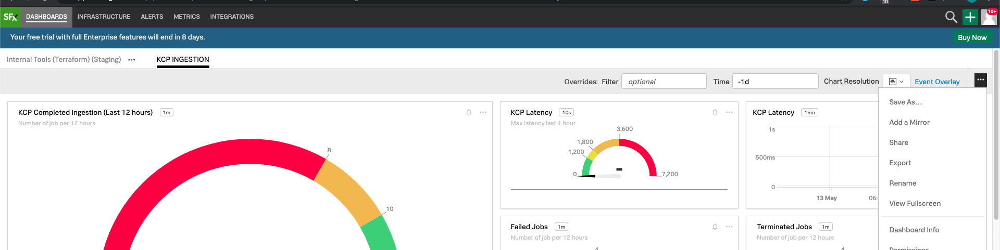

# SignalFx Terraform Migrator

A Python script for generating Terraform configuration from SignalFx JSON exports.

## How to use

### 1. Export a SignalFx dashboard as JSON

Drag the JSON file to this project directory.

### 2. Move JSON file to project directory

### 3. Change the value of `signalfx_export_path` to point to the JSON file

### 4. Start the generation with `python3 main.py`

The newly generated terraform file is found in `output/output.tf`.

Move the file to your Terraform project.

The `dashboard_group` attribute of the generated dashboard resource should be changed to point to an existing dashboard group provisioned with Terraform.

## How it works

### 1. Auto-generation of resource blocks

The `terraform import` command allows one to import existing infra to a state file. For each resource to be imported, a resource block must be written first.

The tool takes in a JSON that SignalFx exports and generates a resource block for each dashboard/chart.

### 2. State Importing

The `terraform import` command is run for each dashboard/chart resource and imported to a state file (which will be deleted).

### 3. State Show and serialization

The `terraform state show` command is run for each resource that was imported. The output, which is the resource block with attributes filled out, is written to `output/output.tf`.

There are three transformation that happen to each resource block outputted by `terraform state show` before they are written to a file:

1. Removing of `id` and `url` attributes
2. Changing of `chart_id` value from actual ids on SignalFx to a resource reference (e.g. `signalfx_single_value_chart.failed_jobs.id`)
3. Changing of `<<~EOT EOT` to `<<-EOF EOF`
