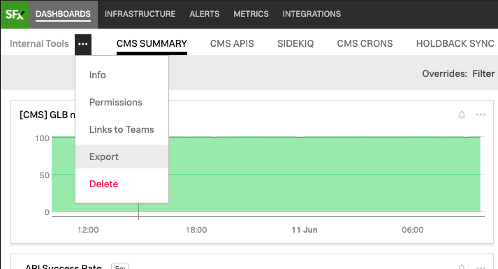
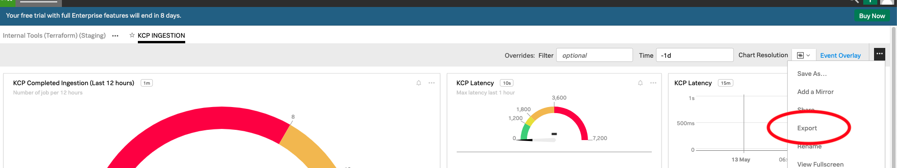

# SignalFx Terraform Migrator

A Python script for generating Terraform configuration from SignalFx dashboard group and dashboard JSON exports.

## How to use

### Migrating a Dashboard Group

1. Export a SignalFx dashboard group as JSON

2. Move JSON file to project directory

3. Set the following constants to their appropriate values

`DASHBOARD_GROUP_PATH` - points to the JSON file

`DASHBOARD_GROUP_NAME` - the terraform name of the dashboard group. Only alphanumerics, dash, and underscore are allowed.

`DB_GROUP_ID` - The ID of the dashboard group. Can be found under the dashboard group's Info popup.

4. Start the generation with `python3 generate_dashboard_group.py`

The newly generated terraform files are found in `{DASHBOARD_GROUP_NAME}/`.

Move the files to your Terraform project.

### Migrating a Dashboard

1. Export a SignalFx dashboard as JSON

2. Move JSON file to project directory

3. Set the following constants to their appropriate values

`DASHBOARD_PATH` - points to the JSON file

`DASHBOARD_GROUP_NAME` - the terraform name of the dashboard group (purely for folder/file name generation). Only alphanumerics, dash, and underscore are allowed.

4. Start the generation with `python3 generate_dashboard.py`

The newly generated terraform files are found in `{DASHBOARD_GROUP_NAME}/`.

Move the files to your Terraform project.

## How it works

### 1. Auto-generation of resource blocks

The `terraform import` command allows one to import existing infra to a state file. For each resource to be imported, a resource block must be written first.

The tool takes in a JSON that SignalFx exports and generates a resource block for each dashboard group/dashboard/chart.

### 2. State Importing

The `terraform import` command is run for each dashboard group/dashboard/chart resource and imported to a state file (which will be deleted).

### 3. State Show and serialization

The `terraform state show` command is run for each resource that was imported. The output, which is the resource block with attributes filled out, is written to `output/*.tf`.

There are four transformations that happen to the resource block outputted by `terraform state show` before they are written to a file:

1. Removing of `id` and `url` attributes
2. Changing of dashboard's `chart_id` and `dashboard_group` from actual ids on SignalFx to a resource reference (e.g. `signalfx_single_value_chart.failed_jobs.id`)
3. Changing of `<<~EOT EOT` to `<<-EOF EOF`
